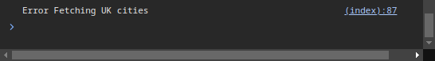

# Project Title
Bright PHP Technical Challenge

# Description
This App was created to showcase the process getting the weather of a certain city in the UK.\
The initial form gets all the UK cities first then compares the user input to it. if all successful a\ 
page of weather details will be returned to the user. If not Errors will be handled depending on \
their nature

# Completed Requirements
* The app is written in PHP - Symfony.
* The app is accessible from all modern web browsers (ie. Chrome, Firefox).
* The application accepts the name of a UK city as input from the user.
* The app Interacts with the Open Weather Map API to get weather data.
* The necessary details are displayed: Temperature, Description, Humidity %, Wind speed and direction.
* Details of uploaded images are stored in a database for audit purposes.
* On successful fetch, confirmation is displayed to the user alongside the weather
details.
* Error scenarios are handled where identified.

# Technologies
- Language = PHP
- Framework: Symfony
- Scripts: JQuery
- Styling: Bootstrap
- Templates: Twig
- API calls: HttpClient

# User road map
1- Initial Form:\

2- Start Typing city name -> uses 3rd party API to compare city names and give suggestions \
If cities API is unavailable, return error in console - continue with the process: 

3- If cities API is available, Display suggestions:

4- If suggestion are ignored and city name is incomplete - return error along the closest option:

5- If the name is valid -> attempt API call to get weather:\
If APY call fails, return the error:

6- If API call is valid proceed to weather details page

# API References
- Open Weather Map API: https://openweathermap.org/guide. API key: '9c3486ac9c58b4dc202be43bde21793c'
- Countries & Cities API: https://countriesnow.space/ (Used to check city names & give live suggestions to user)

# Handled errors
Form Input:
- Invalid form

City Name:
- If city name does not exist in the full list of UK cities 
-> Give suggestions if any close OR return city name does not exist

API exceptions:
- Transport exception
- Client Exception
- Redirection Exception
- Server Exception
- Status code Exception

Used Status Codes:
- 200: Success
- 300: Error but returns the closest city name suggestion
- All other status: Error + Description

# Installation steps (Linux/Ubuntu)
- Clone Git repo
- Install Symfony CLI: https://symfony.com/download
- Install Composer: https://getcomposer.org/download/
- Run: composer update in terminal
- Start PHP server

# Notes
- Levenshtein distance (used to give user suggestions based on comparing the input to the cities list):\
- https://www.php.net/manual/en/function.levenshtein.php